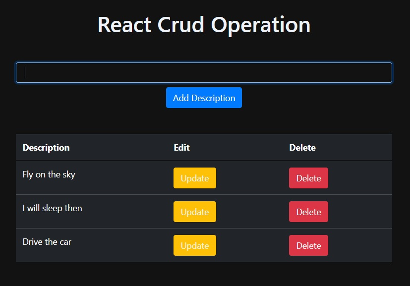

# SimpleCrud
 

A simple application is created to perform CRUD(Create, Read, Update, Delete) operation.

------------------------------

> Frontend: React Js, Express Js 

> Backend: Node Js & PostgreSQL

-----------------------------

## Screen Interface

 

--------------------------
